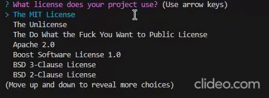

# README.md-Generator    

 ## Description
 
 This application generates a README.md file tailored for your projects.  
 It will create it based on your own input and choices.  
 You will answer a series of questions.  
 Once you have answered all the questions the README.md file will be generated.

Click on the Video Link to view Tutorial:  [Youtube Video Link](https://www.youtube.com/watch?v=LupXOfxSzbc)
 
 ## Table of Contents
 
  - [Installation](#installation)
  - [Usage](#usage)
  - [Contributing](#contributing)
  - [Tests](#tests)
  - [Credits](#credits)
  - [License](#license)
  - [Questions](#questions)
 
 ## Installation
 
 You will need to install:  
 1. node.js
 2. NPM  
 3. Inquirer 8.2.4  
 
 ## Usage
 
 1. Type `npm install -y` to install dependencies.  
 2. Run `node index.js` in the terminal.  
 3. Answer the questions displayed.  
 a. What is the title of your project?  
 b. Write a description about your project.  
 c. How is your project installed. Are there any requirements?  
 d. How do you use or operate or project?  
 e. How may a user contribute to your project?  
 f. What applications are needed to test your project?  
 g. Any credits to your project  
 h. What license does your project use?  
  
 i. What is your Github Username?  
 j. What is your email?

 Once questions have been answered the README.md will be generated.    
 
 ## Contributing
 
 To contribute to this repository you may contact me for further details.  
 Contact details below in the Questions Section.
 
 ## Tests
 
 N/A
 
 ## Credits
 
 N/A
 
 ## License

   
 **The MIT License**  
 Please refer to the LICENSE in the repository.

 ## Questions
 
 **If you have any questions you may reach me at my email: [cont_rune_encoder@outlook.com](mailto:cont_rune_encoder@outlook.com)**  

 **Here is a link to my Github Profile: [Profile Link: rune-encoder](https://github.com/rune-encoder)**  

 **If you would like to check out my other projects visit this link: [Projects Link: rune-encoder](https://github.com/rune-encoder?tab=repositories)**  
    
## Screenshot
>Screenshot of Application:
  